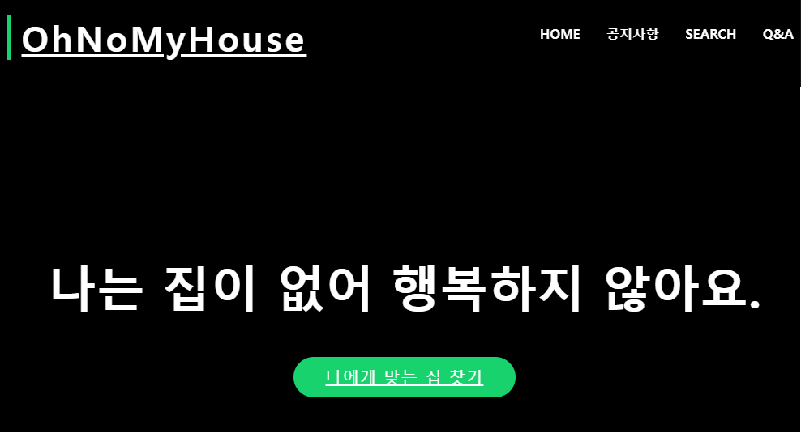
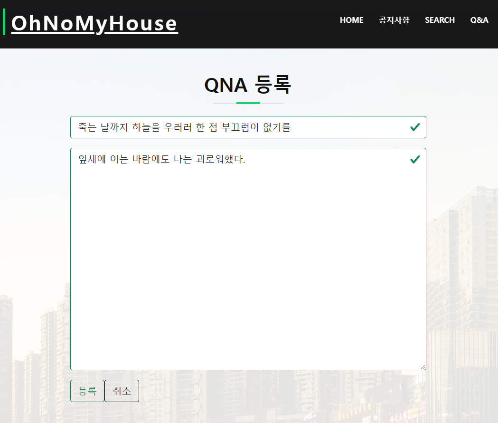
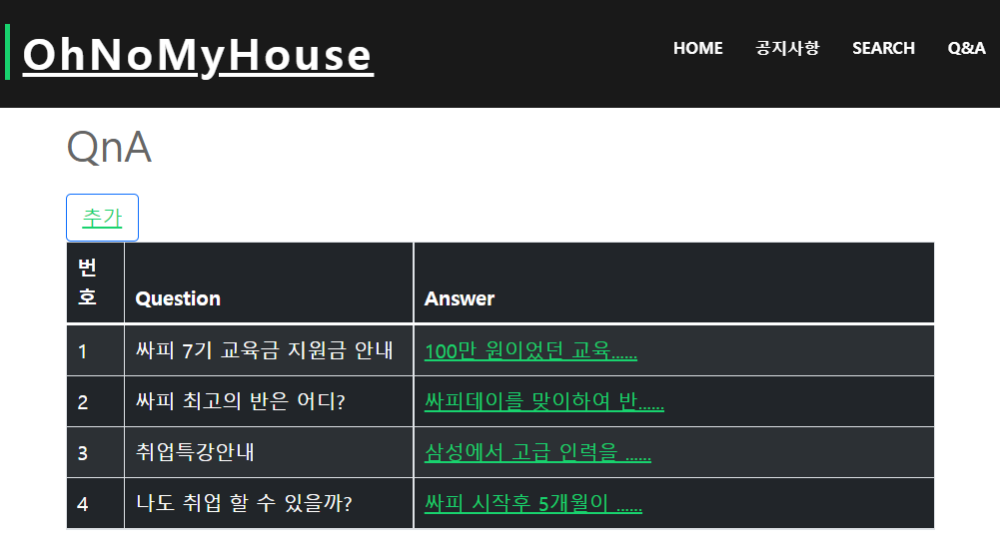
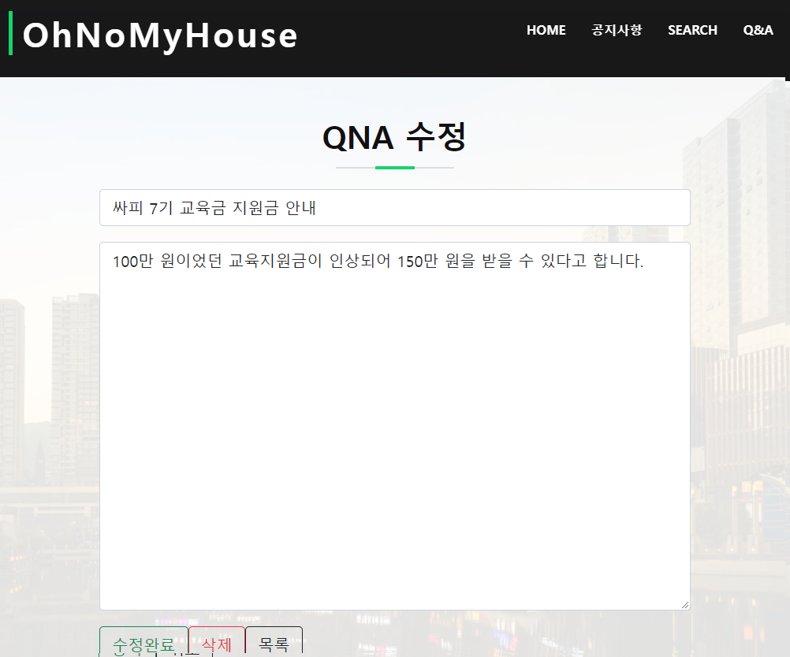

# 🎀SSAFY sp번째 관통프로젝트🎀

# OhNoMyHouse

### 집이 없는 당신을 위한 Project

---

---

### 팀원 소개

| 팀원   | 소개                                     |
| ------ | ---------------------------------------- |
| 민상규(https://lab.ssafy.com/qksl7504) | 잘생긴 상규,                |
| 정태영(https://lab.ssafy.com/taeyeong.jeong419) | 귀요미 탱구,  |

---

### 🧩 단계별 구현

| 난이도 | 구현 기능                                         | 완성 여부 |
| :----: | :------------------------------------------------ | :-------: |
|  기본  | 회원 - 회원 가입                     |    ⭕     |
|  기본  | 회원 - 회원 정보 조회               |    ⭕     |
|  기본  | 회원 - 회원 정보 수정               |    ⭕     |
|  기본  | 로그인                            |    ⭕     |
|  기본  | 로그아웃                            |    ⭕     |
|  기본  | 비밀번호 찾기     |    ⭕     |
|  기본  | 지역별 아파트 정보 조회     |    ⭕     |
|  기본  | 아파트 이름별 거래 정보 조회         |    ⭕     |
|  기본  | 지역별 아파트 거래 정보 조회 |    ⭕     |
|  추가  | 지역별 주변 상권 조회                              |    ⭕     |
|  심화  | 공지사항 등록     |    ⭕     |
|  심화  | 공지사항 수정     |    ⭕     |
|  심화  | 공지사항 삭제     |    ⭕     |

---

### Usecase Diagram

</img>
</img>

---

### Class Diagram

</img>

---

### 💻 구현페이지 (웹 페이지)

#### No.01 회원 - 회원 가입

</img>

- 회원 가입이 가능하다.

---

#### No.02 회원 - 회원 정보 조회

</img>

- 나의 회원 정보 조회가 가능하다.

---

#### No.03 회원 - 회원 정보 수정

</img>

- 나의 회원 정보를 수정할 수 있다.

---

#### No.04 로그인

</img>

- login 버튼을 누르면 해당화면으로 이동하고 로그인을 할 수 있다.

---

#### No.05 로그아웃

</img>

- 로그아웃을 할 수 있다.

---

#### No.06 비밀번호 찾기

</img>

- 비밀번호를 찾을 수 있다.

---

#### No.07 지역별 아파트 정보 조회

</img>

- 지역에 따라 아파트 정보 조회가 가능하다.

---

#### No.08 아파트 이름별 거래 정보 조회

</img>

- 아파트 이름을 통해 실거래가 정보를 조회할 수 있다.
- 검색 : 아파트 이름이 검색어를 포함할 경우

---

#### No.09 지역별 아파트 거래 정보 조회

</img>

- 지역에 따라 아파트 실거래가 정보 조회가 가능하다.

---

#### No.10 지역별 주변 상권 조회

</img>

- 지역에 따라 주변 상권 정보 조회가 가능하다.

---

#### No.11 공지사항 등록

</img>

- 공지사항을 등록할 수 있다.

---

#### No.12 공지사항 수정

</img>

- 공지사항을 수정할 수 있다.

---

#### No.13 공지사항 삭제

</img>

- 공지사항을 삭제할 수 있다.

---
