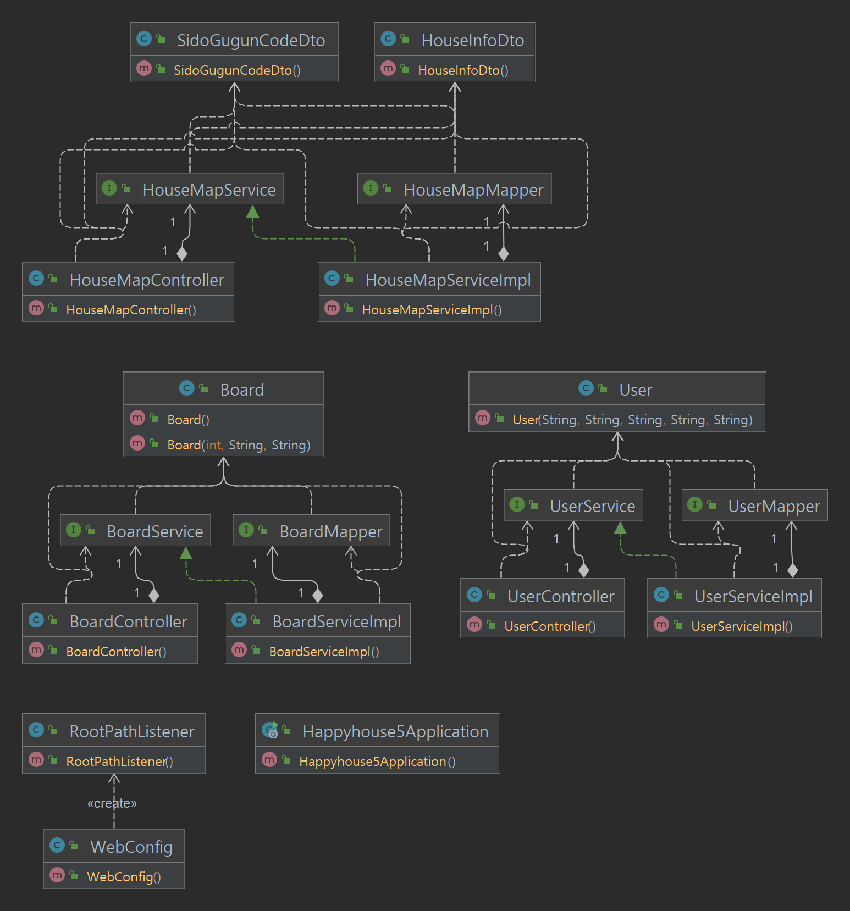
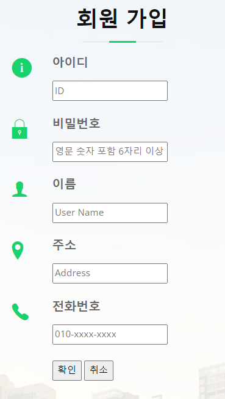
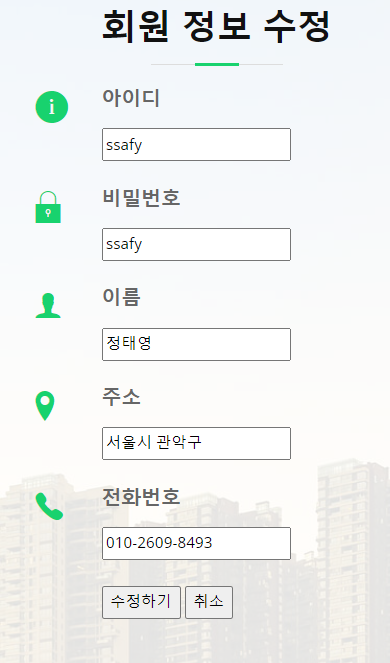
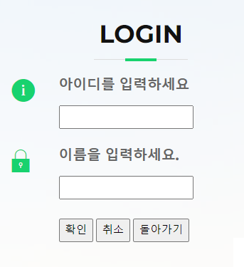
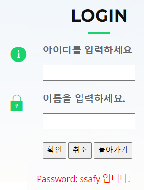
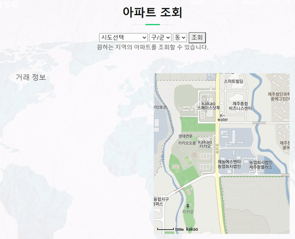
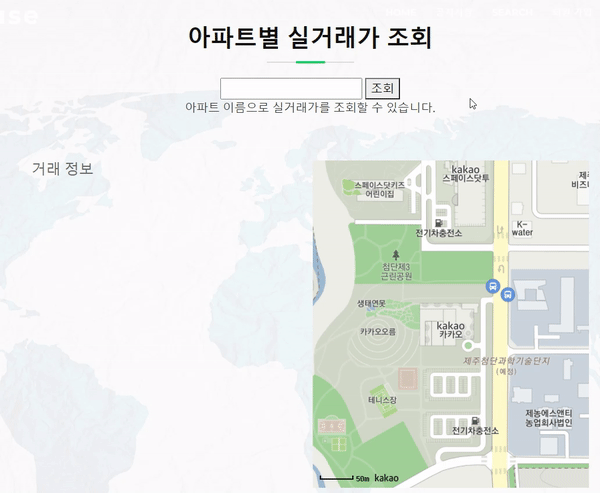
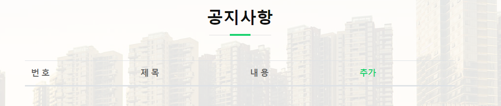
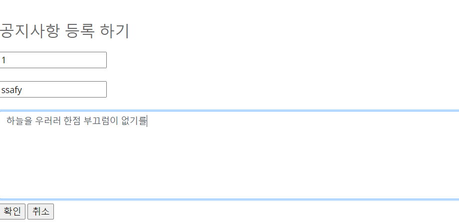
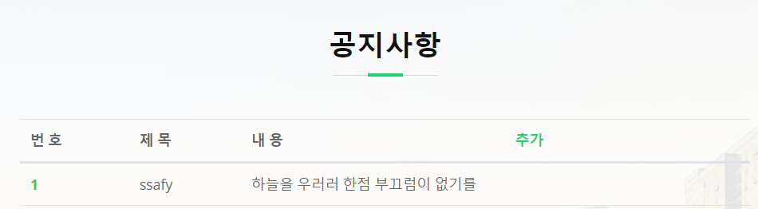

# 🎽 SSAFY 다섯 번째 관통 PJT 🎽

# OhNoMyHouse

### 집이 없는 당신을 위한 Solution

###   

---


---

### 팀원 소개

| 팀원                                             | 소개      |
|------------------------------------------------|---------|
| [민상규](https://lab.ssafy.com/qksl7504)          | 잘생긴 상규  |
| [정태영](https://lab.ssafy.com/taeyeong.jeong419) | 귀요미 탱구  |

---

### 🧩 단계별 구현

| 난이도 | 구현 기능                                         | 완성 여부 |
| :----: | :------------------------------------------------ | :-------: |
|  기본  | 회원 - 회원 가입                     |    ⭕     |
|  기본  | 회원 - 회원 정보 조회               |    ⭕     |
|  기본  | 회원 - 회원 정보 수정               |    ⭕     |
|  기본  | 로그인                            |    ⭕     |
|  기본  | 로그아웃                            |    ⭕     |
|  기본  | 주택 실거래가 정보 수집     |    ⭕     |
|  기본  | 지역별 아파트 정보 조회     |    ⭕     |
|  기본  | 아파트 이름별 거래 정보 조회         |    ⭕     |
|  기본  | 지역별 아파트 거래 정보 조회 |    ⭕     |
|  추가  | 관심 지역 등록                              |    🔺     |
|  추가  | 관심 지역 정보 제공                         |    🔺     |
|  심화  | 공지사항 등록     |    ⭕     |
|  심화  | 공지사항 수정     |    ⭕     |
|  심화  | 공지사항 삭제     |    ⭕     |

---

### Usecase Diagram

</img>
</img>

---

### Class Diagram

</img>

---

### 💻 구현페이지 (웹 페이지)

#### No.01 회원 - 회원 가입

</img>

- 회원 가입이 가능하다.

---

#### No.02 회원 - 회원 정보 조회

</img>

- 나의 회원 정보 조회가 가능하다.

---

#### No.03 회원 - 회원 정보 수정

</img>

- 나의 회원 정보를 수정할 수 있다.

---

#### No.04 로그인

</img>

- login 버튼을 누르면 해당화면으로 이동하고 로그인을 할 수 있다.

---

#### No.05 로그아웃

</img>

- 로그아웃을 할 수 있다.

---

#### No.06 비밀번호 찾기

</img>

- 비밀번호를 찾을 수 있다.

---

#### No.07 지역별 아파트 정보 조회

</img>

- 지역에 따라 아파트 정보 조회가 가능하다.

---

#### No.08 아파트 이름별 거래 정보 조회

</img>

- 아파트 이름을 통해 실거래가 정보를 조회할 수 있다.
- 검색 : 아파트 이름이 검색어를 포함할 경우

---

#### No.09 공지사항 등록

</img>

- 공지사항을 등록할 수 있다.

---

#### No.10 공지사항 수정

</img>

- 공지사항을 수정할 수 있다.

---

#### No.11 공지사항 삭제

</img>

- 공지사항을 삭제할 수 있다.

---

### 🎁 알고리즘 적용

- 개인 정보 저장 암호화
1. 개요

key가 56비트인 Block Cipher 중 DES(Data Encryption Standard)라는 표준이 있었다. 이는 1976년에 미국에서 내놓으라 하는 천재들 15명이 2년 동안 NSA에서 고안해내 만든 암호기법이다. 하지만 반도체의 집적과 슈퍼컴퓨터의 발전으로, DES는 보안에 취약해졌다. 그래서 미국 정부는 2000년 밀레니엄 시대를 맞아서, DES를 대신할 AES라는 표준을 만들었다.

2. 알고리즘 개요

AES는 고급 암호화 표준이라는 의미이며, 암호화 및 복호화 시 같은 키를 사용하는 대칭키 알고리즘이다. AES의 종류는 AES-128, AES-192, AES-256이 있고 각각 뒤에 붙은 숫자가 키의 길이를 의미한다. AES 암호화 알고리즘은 높은 안정성과 빠른 속도로 전 세계적으로 사용되고 있다. AES 암호화는 크게 두 가지 방법으로 나뉘는데 하나는 Secret Key로 평문을 암호화하는 데 사용되며 절대로 외부에 노출되어서는 안 된다. AES의 종류가 무엇이냐에 따라 Secret Key의 길이가 달라진다(AES -256은 256비트(32바이트)의 키를 사용한다.). 다른 하나는 Block Cipher 불리는 기술로 128비트(16바이트)의 고정된 블록 단위로 암호화를 수행한다. 암호화를 수행할 때 여러 가지 Block Cipher Mode를 선택할 수 있으며 크게 CBC, ECB 등이 있다. AES는 128비트의 블록 단위로 암호화를 수행하는데 128비트보다 작은 블록이 생길 때 부족한 부분을 특정 값으로 채워야 한다. 이러한 작업을 패딩이라고 부르며, 대표적으로 PKCS5, PCKS7 방식이 있다.

3. 적용된 알고리즘

AES는 128비트의 고정된 블록 단위로 암호화를 수행하는데, CBC는 블록을 그대로 암호화 하지 않고 이전에 암호화했던 블록과 XOR 연산을 한 다음에 암호화를 수행한다. 그래서 같은 내용을 갖는 원문 블록이라도 전혀 다른 암호문을 갖게 된다. 그런데 첫 번째 블록은 이전 암호화 블록이 없으므로 이를 위해 IV(initialization vector)를 이용한다. AES는 128bit(16바이트) 단위로 암호화 하므로 IV 또한 16바이트 크기여야 한다. IV가 생성되면 이 값을 가지고 첫 번째 블록을 암호화한다. 매번 다른 IV를 생성하면 같은 평문이라도 다른 암호문을 생성할 수 있다.

4. 적용 서비스

먼저 사용자가 회원가입을 하면 Password 부분이 AES 암호화가 적용되어 DB에 저장된다. 이후 사용자가 로그인할 때 입력하는 입력값에 AES 암호화 키를 적용해 암호화된 문구와 DB에 저장된 문구를 비교하여 일치한다면 같은 비밀번호로 보고 로그인을 가능하게 하며, 사용자가 회원 정보를 수정하고자 할 때 AES 암호화된 비밀번호를 복호화하여 사용자가 회원가입 때 기재한 비밀번호를 보이게끔 Model에 Id와 Password를 담아 View에 Return 한다.

```
public class AES256 {
		public static String alg = "AES/CBC/PKCS5Padding";
		private final String key = "01234567890123456789012345678901";
		private final String iv = key.substring(0, 16); // 16byte
		
		public String encrypt(String text) throws Exception {
		    Cipher cipher = Cipher.getInstance(alg);
		    SecretKeySpec keySpec = new SecretKeySpec(key.getBytes(), "AES");
		    IvParameterSpec ivParamSpec = new IvParameterSpec(iv.getBytes());
		    cipher.init(Cipher.ENCRYPT_MODE, keySpec, ivParamSpec);
		
		    byte[] encrypted = cipher.doFinal(text.getBytes("UTF-8"));
		    return Base64.getEncoder().encodeToString(encrypted);
		}
		
		public String decrypt(String cipherText) throws Exception {
		    Cipher cipher = Cipher.getInstance(alg);
		    SecretKeySpec keySpec = new SecretKeySpec(key.getBytes(), "AES");
		    IvParameterSpec ivParamSpec = new IvParameterSpec(iv.getBytes());
		    cipher.init(Cipher.DECRYPT_MODE, keySpec, ivParamSpec);
		
		    byte[] decodedBytes = Base64.getDecoder().decode(cipherText);
		    byte[] decrypted = cipher.doFinal(decodedBytes);
		    return new String(decrypted, "UTF-8");
		}
}
```

--------------

- 사용자의 부동산 매물 방문 경로 최적화
1. 개요

허위 매물이 판치는 요즘 좋은 아파트 매물을 찾는 것도 중요하지만, 찾은 아파트 매물이 허위 매물인지 아닌지 판단하는 것도 중요하다. 허위 매물을 판단하기 위한 가장 확실한 방법은 직접 아파트 매물에 방문하는 것이므로 우리는 사용자가 찾은 아파트 매물들을 어떻게 하면 효율적으로 최단 시간에 방문할 수 있을지 고민한 결과 아파트 매물을 하나의 정점으로 보고 최소 시간으로 노드 정점을 방문하는 최소 신장 트리 알고리즘을 적용하고자 했다.

2. 알고리즘 개요

신장 트리는 그래프 내의 모든 정점을 포함하는 트리로, n개의 정점을 가지는 그래프의 최소 간선의 수는 (n-1) 개이고, (n-1) 개의 간선으로 연결되어 있으면 필연적으로 트리 형태가 되는데 이것이 바로 신장 트리다. 다만, 각 간선의 가중치가 같지 않을 때 단순히 가장 적은 간선을 사용한다고 해서 최소 비용이 얻어지는 것이 아니므로 가중치를 고려할 때 최소 비용의 신장 트리(MST)를 선택한다면 최소 신장 트리가 된다. 따라서 최소 신장 트리는 네트워크에 있는 모든 정점을 가장 적은 수의 간선과 비용으로 연결하는 것이다.

3. 적용된 알고리즘

Prim 알고리즘이란 시작 정점에서부터 출발하여 신장트리 집합을 단계적으로 확장해나가는 방법이다. Prim 알고리즘이 동작하는 방식은 먼저, 시작 단계에서는 시작 정점만이 MST 집합에 포함한다. 그다음 트리가 (N-1) 개의 간선을 가질 때까지 MST 집합에 인접한 정점 중에서 최소 간선으로 연결된 정점을 선택하여 트리를 확장하면 최소 신장 트리가 완성된다.

4. 적용 서비스

먼저 사용자에게 보고자 하는 아파트 매물이 요청되면, Controller에서 ResponseEntity Type으로 HouseInfoDto를 return 하기 전에 Prim 알고리즘을 호출한다. 호출된 Prim 알고리즘을 적용하기 위해선 아파트 매물 데이터가 전처리 단계를 거치게 되는데, Web Crawling을 통하여 데이터를 얻은 뒤 전처리를 하였다. 아파트 매물의 경도와 위도를 가지고 Kakao map에 경로 검색을 하여 다른 아파트 매물과의 모든 경로 map[][] 2차원 인접 배열에 저장한다. 그다음 각 아파트 매물과의 최단 경로를 가지고 Prim 알고리즘을 적용해 어떤 아파트 매물 순서로 방문을 하는 게 가장 빠른지 계산하게 된다. 이렇게 계산된 아파트 매물의 방문 순서와 방문하는 데 걸린 최소시간을 Controller에 return 하게 되고, 이 결괏값을 view 페이지로 사용자에게 응답하게 된다.
